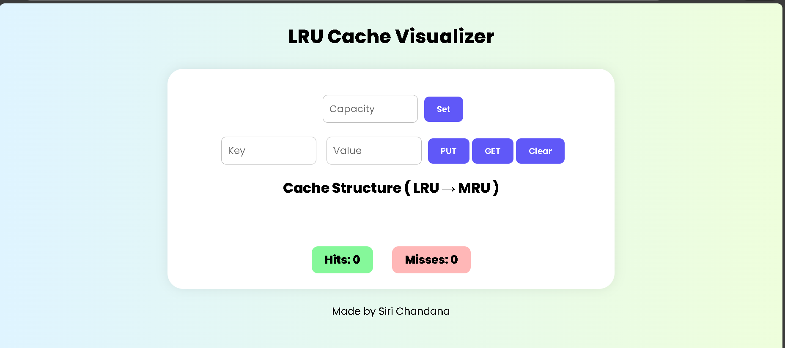

# 📘 LRU Cache Visualizer

An interactive and beginner-friendly web tool to understand how an **LRU (Least Recently Used) Cache** works internally.  
This visualizer demonstrates **insertion, access, cache reordering, eviction logic, HIT/MISS tracking, and LRU → MRU transitions** — making it a perfect learning project for DSA, interviews & teaching.

---

### 🔗 Live Demo  
👉 **https://sirichandana17.github.io/lru-cache-visualizer/**  

---

## 🖼 Preview

---

## 💡 About the Project

The project simulates an **LRU Cache using JavaScript** and visually displays cache nodes in order:
**LRU → … → MRU**

When capacity is full, the **least recently used item is automatically removed**, helping users clearly understand cache eviction.  
On every **PUT/GET**, cache updates are shown instantly with **HIT/MISS indicators** and **highlight animations**.

---

## 🚀 Features

- Set cache capacity dynamically
- Perform **PUT & GET** operations
- Automatically **evicts LRU item**
- Color-coded result messages  
  🟩 HIT | 🟥 MISS | 🟧 LRU removal
- Visual arrangement of nodes (LRU → MRU)
- Stores **key-value pairs**
- Clean and minimal UI

---

## 🧠 How it Works

| Operation | Result |
|---|---|
| `PUT` new key | MISS → Insert item |
| `PUT` existing key | HIT → Move to MRU |
| `GET` key | HIT & move to MRU |
| Capacity Full | LRU removed + new key inserted |

---

## 🛠 Tech Stack

| Tech | Usage |
|---|---|
| **HTML** | UI Structure |
| **CSS** | Layout & Styling |
| **JavaScript** | LRU Cache Logic & Visualization |

---

## ✨ Author

**Siri Chandana**
